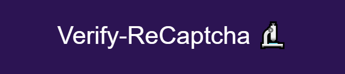

<br/><br/>
Verify-ReCAPTCHA is a simple serveless microservice API to check for bots on your website or apps by checking the token given by Google's ReCAPTCHA v3.
<br /><br/>
## Installation

*This guide assume you have basic knowledge about NPM (also that it's installed) and possess AWS and Google accounts.*

Automatic CI/CD using GH Actions is not covered in this readme.
<br/><br/>

First you need to clone this repo, then you can follow along the instructions below 😉

### Google

These are the necessary steps to get your own ReCAPTCHA credentials for your apps.

**The API currently only allows the use of one secret, so you'll have to put all of your apps/website in the same registration, or you can host a different API for every website.**

1. Go to [Google's ReCAPTCHA admin](https://www.google.com/u/0/recaptcha/admin/) and connect with your account.
2. Register a new website (choose ReCAPTCHA v3) - Don't forget to add `localhost` to the authorized domains if you plan on testing with a frontend on localhost.
3. Copy the site and secret keys (site key is for your frontend, secret for the verification on the backend).

**Do not share your secret key and do not save it on GitHub or any other public file!**

### AWS
These are the steps to set up a Lambda function in order to host the API.

1. Go to the AWS console and log in.
2. Go to the Lambda functions console and create a new function.
3. Set the following settings:
    - Allow origin: You can add your domains (one per line) or keep the wildcard character (*) in order to allow all origins (not recommended)
    - Function name: `verify-recaptcha` (you can call it whatever you want, but the workflows are set up for this name, if you decide to go this route).
    - Runtime: Node.js
    - Architecture: x86_64
    - Advanced settings:
      - Check: "Enable function URL".
      - Auth type: "NONE".
      - Check "Configure cross-origin resource sharing (CORS)"
4. In the tab "Configuration":
    - Function URL: click "Edit" on the top-right.
      - Under "Allow headers", click "Add new value" and type in `content-type`.
      - Under "Allow methods", check "POST".
5. In the "Environment variables" menu section (on the left):
    - Click "Edit" then "Add environment variable"
    - Add the following:
      - Key: `SECRET_KEY`
      - Value: Your ReCAPTCHA secret key from earlier.

        **Keep this absolutely secret, don't share it anywhere and only put it on your backend, as an environment variable**
6. Don't forget to note the function URL, we'll use it to call the API from the frontend.

### API directory

These are the steps to automatically bundle the API's code in one big JS file and deploy it manually on Lambda. You can automate the deployment when you push your code on your GitHub repo, by using the included action `deploy.yml` but that's outside the scope of this readme, feel free to do some research about it (most of the work is already done).

1. In your terminal, go the cloned directory.
2. Run the command `npm i` in order to install all the project's dependencies.
3. Run `npm run build`.
4. Open the file `index.js` in the newly created `dist/` directory and copy its content.
4. Go back to the AWS Lambda function dashboard and in the "Code" tab, simply select all (CTRL+A/CMD+A) and paste the content of the newly created `index.js` into the editor.
5. Click "Deploy".

## Usage

Depending on your frontend framework this part can vary so it's up to you to look how to do it.
If you are using React you can use the [react-google-recaptcha-v3](https://www.npmjs.com/package/react-google-recaptcha-v3) package.

If you want to test the API locally you can run `npm run dev` in the API's directory and check the debug console for any error, don't forget to create a `.env` file and add the following lines:
  - `NODE_ENV=development`
  - `PORT=3000` <-- Feel free to change this value if this port is already in use.

Here is an example of API call in React using the given hook from the link above:
```js
  function MyComponent() {
    const { executeRecaptcha } = useGoogleReCaptcha();
    
    async function getRecaptchaToken() {
      if (!executeRecaptcha) {
        return;
      }

      // Silently executes the ReCAPTCHA check and returns a token
      return await executeRecaptcha();
    }

    async function verifyRecaptcha() {
      try {
        const token = await getRecaptchaToken();

          // if getRecaptchaToken() returns 'undefined'
        if(token == null) {
          // Do some frontend stuff in order to tell the user something went wrong, retry to get the token, ...
          return;
        }

        // Sending the token to our API
        const res = await fetch('YOUR_LAMBDA_URL_OR_LOCALHOST:PORT', {
          method: 'POST',
          headers: {
            'Content-Type': 'application/json',
          },
          body: JSON.stringify({ token });
        });
  
        // The token wasn't valid (user is probably a bot) or something went wrong on the backend.
        // Check the debug console (if running the API locally) or Lambda's logs for more info.
        if(res.status !== 200) {
          return false;
        }
  
        // At this point, the ReCAPTCHA has been validated and you can assume the user is not a bot 🥳
        return true;
      } catch(e) {
        // Handle error
      }
    }
  }
```

## Contributing

Feel free to send a PR, this is a small side project and if you spot any error in the code or README, I would appreciate your help 🙂

## License

This software is under the [MIT](https://choosealicense.com/licenses/mit/) license, a short and simple permissive license with conditions only requiring preservation of copyright and license notices. Licensed works, modifications, and larger works may be distributed under different terms and without source code. (Do whatever you want with it 🤙).
